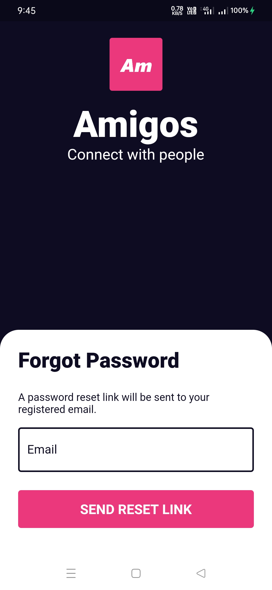
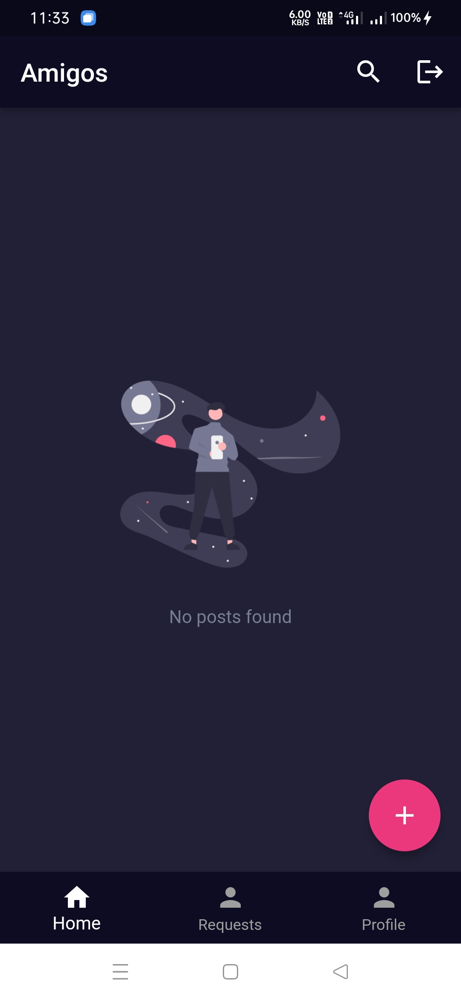

# Amigos

A social media app built using Flutter.

## App Icon

## Download
Download this app from [here][1]

## Screenshots
| Screenshot 1  | Screenshot 2  | Screenshot 3 |
| --------------- | --------------- |------------|
|  |  |  |
| Screenshot 4  | Screenshot 5  | Screenshot 6 |
|  |  |  |
| Screenshot 7  | Screenshot 8  | Screenshot 9 |
|  |  |  |
| Screenshot 10  | Screenshot 11  | Screenshot 12 |
|  |  |  |
| Screenshot 13  | Screenshot 14  | Screenshot 15 |
|  |  |  |
| Screenshot 16  | Screenshot 17  | Screenshot 18 |
|  |  |  |
| Screenshot 19  | Screenshot 20  | Screenshot 21 |
|  |  |  |
| Screenshot 22  | Screenshot 23  | Screenshot 24 |
|  |  |  |

## Author
<b>Rajit Deb</b>

## Find me on

[1]: https://github.com/rajitdeb/Amigos/raw/8-Add-App-Icons/apk/amigos_final_build.apk
